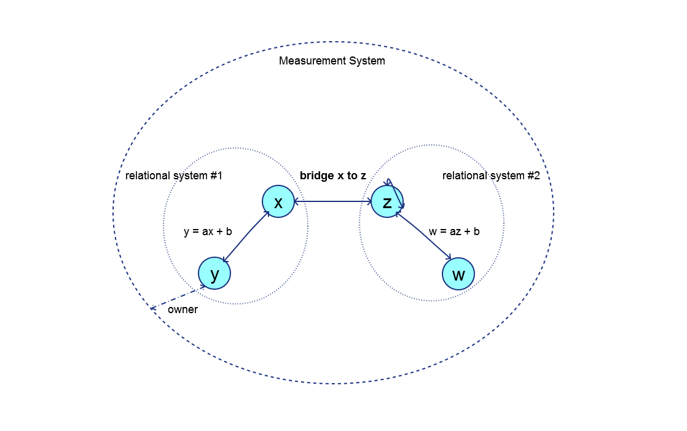

The Point 85 Caliper library project manages units of measure and conversions between them. Caliper is designed to be lightweight and simple to use, yet comprehensive. It includes a large number of pre-defined units of measure commonly found in science, engineering, technology, finance and the household. These recognized systems of measurement include the International System of Units (SI), International Customary, United States and British Imperial. Custom units of measure can also be created in the Caliper unified measurement system. Custom units are specific to a trade or industry such as industrial packaging where units of can, bottle, case and pallet are typical. Custom units can be added to the unified system for units that are not pre-defined.

A Caliper measurement system is a collection of units of measure where each pair has a linear relationship, i.e. y = ax + b where 'x' is the abscissa unit to be converted, 'y' (the ordinate) is the converted unit, 'a' is the scaling factor and 'b' is the offset. In the absence of a defined conversion, a unit will always have a conversion to itself. A bridge unit conversion is defined to convert between the fundamental SI and International customary units of mass (i.e. kilogram to pound mass), length (i.e. metre to foot) and temperature (i.e. Kelvin to Rankine). These three bridge conversions permit unit of measure conversions between the two systems. A custom unit can define any bridge conversion such as a bottle to US fluid ounces or litres.  The diagram below illustrates these concepts:

All units are owned by the unified measurement system. Units 'x' and 'y' belong to a relational system (such as SI or International Customary). Units 'w' and 'z' belong to a second relational system. Unit 'y' has a linear conversion to unit 'x'; therefore 'x' must be defined before 'y' can be defined. Unit 'x' is also related to 'y' by x = (y - b)/a. Unit 'w' has a conversion to unit 'z'. Unit 'z' is related to itself by z = z + 0. Unit 'x' has a bridge conversion defined to unit 'z' (for example a foot to a metre). Note that a bridge conversion from 'z' to 'x' is not necessary since it is the inverse of the conversion from 'x' to 'z'.

<a href="index.html">Return to top</a>

---

<h2>Categories</h2>
The categories of units of measure are:
- **Scalar**: A simple unit of measure, for example a metre, is defined as a scalar UOM. A special scalar unit of measure is unity or dimensionless "1".
- **Product**: A unit of measure that is the product of two other units is defined as a product UOM. An example is a Joule which is a Newton·metre.
- **Quotient**: A unit of measure that is the quotient of two other units is defined as a quotient UOM. An example is a velocity, e.g. metre/second.
- **Power**: A unit of measure that has an exponent on a base unit is defined as a power UOM. An example is area in metre^2. Note that an exponent of 0 is unity, and an exponent of 1 is the base unit itself. An exponent of 2 is a product unit where the multiplier and multiplicand are the base unit. A power of -1 is a quotient unit of measure where the dividend is 1 and the divisor is the base unit.

Units are classified by type, e.g. length, mass, time and temperature. Only units of the same type can be converted to one another. Pre-defined units of measure are also enumerated, e.g. kilogram, Newton, metre, etc. Custom units (e.g. a 1 litre bottle) do not have a pre-defined type or enumeration and are referred to by a unique base symbol.

All units have a base symbol that is the most reduced form of the unit. For example, a Newton is kilogram·metre/second^2. The base symbol is used in the measurement system to register each unit and to discern the result of arithmetic operations on quantities. For example, dividing a quantity of Newton·metres by a quantity of metres results in a quantity of Newtons.

<a href="index.html">Return to top</a>

---

<h2>Quantity</h2>

A quantity is an amount (implemented as a double precision number) together with a unit of measure. When arithmetic operations are performed on quantities, the original units can be transformed. For example, multiplying a length quantity in metres by a force quantity in Newtons results in a quantity of energy in Joules (or Newton-metres).

<a href="index.html">Return to top</a>

---